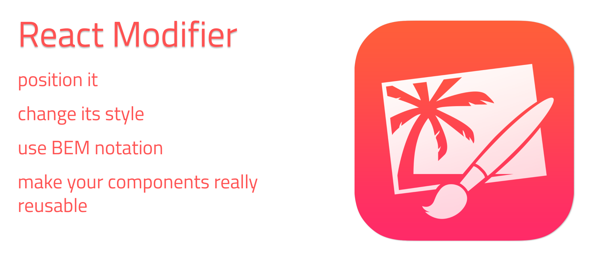

# React Modifier

ReactModifier is a tool that can help you to customize app. Main idea - many themes, one component.



<div style="text-align: center">

 <!-- version -->
 <!-- size -->
 <!-- downloads -->
 <!-- licence -->

</div>

This package can:
- Mix modifiers
- Modify component head to position it
- Modify whole component to apply a theme

<div style="text-align: center">
    :octocat: <a href="https://github.com/Kostayne/react-modifier">See source code in github</a>
</div>

## What's the problem?
How many component's visual style can you modify without changing its code? The value is low I bet.

An example of typical situation

``` tsx
const TestC = (
    <div classname="test">
        <div className="test__block">
            <span className="test__text">Text</span>
        </div>
    </div>
);

const App = (
    <div classname="app">
        <TestC />
    </div>
);
```

Can't add theme or change position. Obviously you can't reuse that component. Cause if you're going to position it, you position it **everywhere**.

Can we solve the problem? Actually we can. There is 2 ways:
1. Create wrapper with class, that modifies nested elements
2. Create component, that receives modifiers props, and returns modified version.

Solved example:
``` tsx
// first method
const App = (
    <div classname="app">
        {/* unwanted structure */} 
        <div className="app__testc">
            <TestC />
        </div>
    </div>
);

// second method
const mod = { className: "app__testc" };
const App = (
    {/* all good */} 
    <div classname="app">
        <TestC mod={mod} />
    </div>
);
```

This package using second way.

## Install
:package: To download this package from npm paste this command in a terminal
```
npm install react-modifier
```

## How to use
First of all you have to import the library.

``` typescript
import * as MD from "react-modifier";
// OR you can import individual functions and interfaces
// import { IModifiableProps, IModifiableTheme, IModifier, createModifier, mixModifiers, modifyElement} from "react-modifier";
```

Then you can create customizable functional or class components

### Functional component example
``` typescript
// define theme interface
export interface FlexAppTheme extends IModifiableTheme {
    textMod: IModifier;
};

// define props interface
export interface IFlexAppProps extends IModifiableProps<FlexAppTheme> {
    text: string;
};

export const FlexAppF: FunctionComponent<IFlexAppProps> = (props: IFlexAppProps) => {
    const { text, theme, mod } = props;
    const headMod = getHeadModByProps(props);

    return modifyElement((
        <div className="app">
            {modifyElement((
                <span className="app__text">
                    {text}
                </span>
            ), theme.textMod)}
        </div>
    ), headMod);
}

// theme instance
const defaultTheme: FlexAppTheme = {
    head: createModifier(""),
    textMod: createModifier("")
}

const darkTheme: FlexAppTheme = {
    head: createModifier("app_dark"),
    textMod: createModifier("app__text_dark")
}

// all themes
export const flexAppThemes = {
    dark: darkTheme,
    default: defaultTheme
};
```

### Class component

Just import IModifiableComponent class.

``` typescript
export class FlexApp extends IModifiableComponent<FlexAppTheme, IFlexAppProps> {
    constructor(props: IFlexAppProps) {
        super(props);
    }

    renderThemed() {
        <div className="app">
            {modifyElement((
                <span className="app__text">
                    {this.props.text}
                </span>
            ), this.theme.textMod)}
        </div>
    }
}

// also it's possible to pass third type or interface, that describes State
// <FlexAppTheme, IFlexAppProps, IFlexAppState>
```

Okay, now we can use new component.
A Theme prop is required, mod is optional, you always can define default theme in component.

``` typescript
FlexAppF text="It actually works" mod={createModifier("root__app")} theme={flexAppThemes.dark}></FlexAppF>
```

The result will be
``` html
    <div class="app root__app app_dark">
        <span class="app__text app__text_dark">It actually works</span>
    </div>
```

## Documentation
Let's take a look how does it work

>### Modifier is just an interface, that haves className and id properties;

``` typescript
interface IModifier {
    className: string;
    id: string;

    // if you want to modify more props, extend this interface
}
```

> ### createModifier function wraps your args to new IFlexCompnentModifier obj

``` typescript
// createModifier(className, id?);
createModifier("mod_class", "mod-el");
createModifier("mod_class");
```

> ### mixModifier function combining all classNames to one and chooses id

``` typescript 
mixModifiers(mod, mod2, mod3...) => IModifier;
```

> ### modifyElement function applies mod on provided element and
returns modified version

``` typescript
modifyElement(element: ReactElement, mod: IModifier): ReactElement;
```

> ### IModifiableProps is an interface that haves theme and head mod

``` typescript 
interface IModifiableProps<T> {
    theme: T; // head && body modifiers
    mod?: IModifier; // component head modifier
}

// extend that interface to add other props
```

> ### IModifiableTheme contains head mod

``` typescript
interface IModifiableTheme {
    head: IModifier;
}

// extend that interface to add other customizable parts
```

> ### IModifiableComponent class choosing what to render by checking props.theme value

``` typescript
// pass your own Theme & Props interface realization
class IModifiableComponent<Theme: IModifiableTheme, Props: IModifiableProps> extends React.Component {
    renderThemed(): ReactElement;
}
```

## Enjoy this package